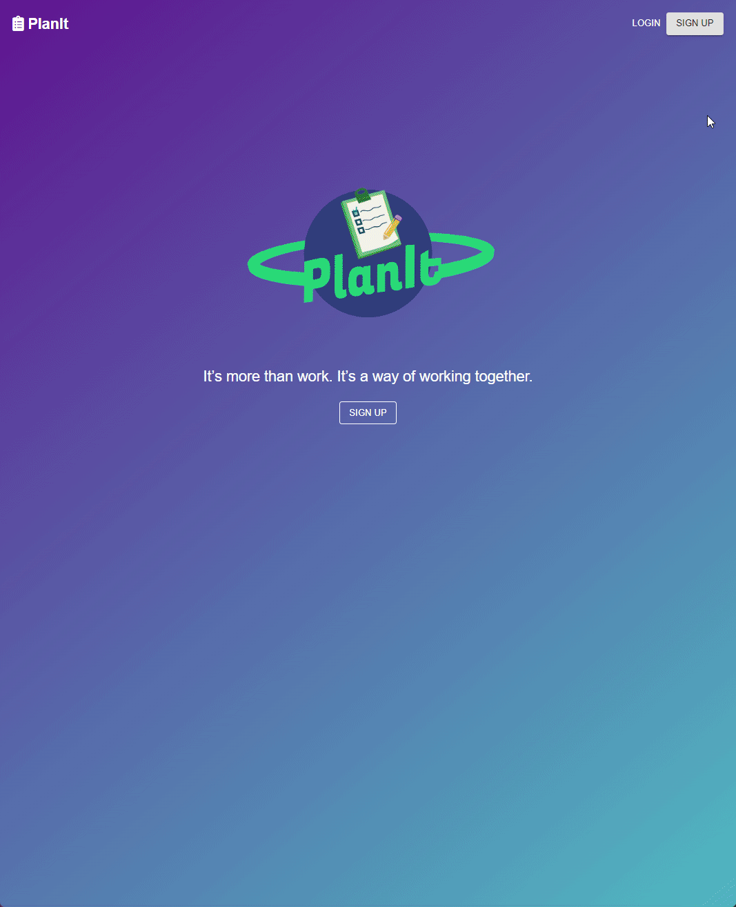
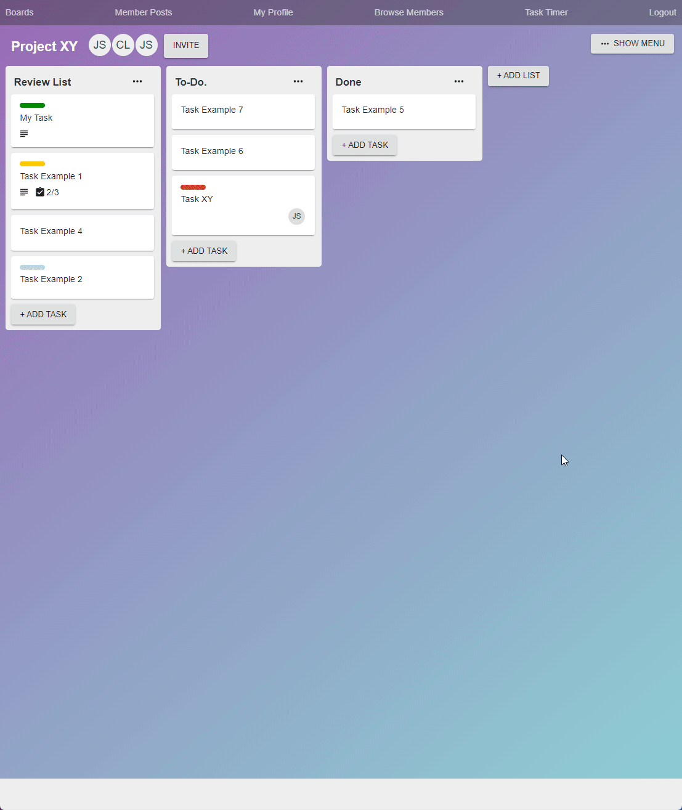

# 

## Link to site
https://planit-capstone.herokuapp.com/

## About

PlanIt is a project management web application built using the MERN stack that aims to increase the productivity of primarily teams of developers, and help streamline their workflow process. The software's primary objective is to provide a medium for teams to organize, plan, communicate, and execute their project needs. Finally, PlanIt utilizes kanban boards where teams can setup the workflow for their project tasks with different stages, a team discussion board area, and a team profile area where team members can browse other team member profiles and find information about them.  


## Application Preview





The user can create a new account or use the following credentials to login:

```
john.smith.capstone.2021@gmail.com
```
```
Capstone2021
```


### <a href="https://imgur.com/a/9Hix32A">More application images</a>


## Deployment 

You will need Node.js installed, a browser, and a terminal to run this application.

### Add a new .env file at the root directory and add the following information: 
```
{
    "mongoURI": "<your_mongoDB_Atlas_uri_with_credentials">,
    "jwtSecret": "a_random_sequence", 
    "githubToken": "<your_secret_access_token>"
}
```

### Install  server dependencies
```
npm install
```
### Install client dependencies
```
cd client
npm install
```

### Run the server from the root directory
```
cd .. 
npm run dev
```

## [Project Documentation]
<body>
    <p> View the detailed project documentation <a href="./planit_documentation/PlanIt Documentation.pdf">here</a>.</p>
</body>


## Misc 
<pre>
ITC 4918 - Software Development Capstone Project
Developer: Christos Lantzos
Supervisor: Prof. Evgenia Vagianou
Deree - The American College of Greece
Spring Semester 2021
</pre>

